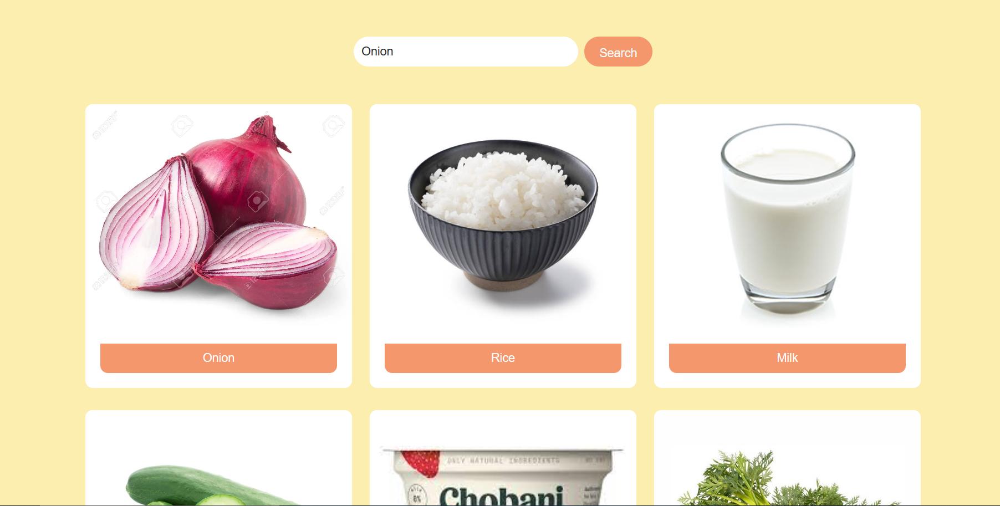

<!DOCTYPE html>
<html>
<head>
  </head>
<body>
 

        

            

                
            

            

                
            

        

        <button class="carousel-control-prev" type="button" data-bs-target="#myCarousel" data-bs-slide="prev">
            
            Previous
        </button>
        <button class="carousel-control-next" type="button" data-bs-target="#myCarousel" data-bs-slide="next">
            
            Next
        </button>
    

  
  
  <h1>Product Recommendation System</h1>

  <h2>Overview</h2>
  

    The recommendation system uses a dataset consisting of user ratings for different products. It calculates the similarity between products using collaborative filtering and recommends similar products to users based on their preferences.
  

  <h2>Components</h2>
  <ul>
    <li>Flask: A micro web framework used to build the web application.</li>
    <li>Pandas: A data manipulation library used for data preprocessing and analysis.</li>
    <li>NumPy: A library used for mathematical operations on arrays.</li>
    <li>SciPy: A library used for scientific computing and similarity calculations.</li>
    <li>Bootstrap: A CSS framework used for styling the web pages.</li>
  </ul>

  <h2>Getting Started</h2>
  <ol>
    <li>Install the required dependencies listed in the <code>requirements.txt</code> file.</li>
    <li>Run the Flask application using the command <code>python app.py</code>.</li>
    <li>Access the web application by opening the provided URL in a web browser.</li>
  </ol>

  <h2>Usage</h2>
  <ol>
    <li>Login to the system using your username and password.</li>
    <li>Enter a product name in the search bar to view the details of the selected product.</li>
    <li>The system will recommend similar products based on the selected product.</li>
    <li>Click on the recommended products to view their details.</li>
  </ol>

  <h2>Dataset</h2>
  

    The recommendation system uses a dataset containing user ratings and product information. The dataset is preprocessed to handle missing values and create a matrix representation of the ratings.
  

  <h2>Collaborative Filtering</h2>
  

    Collaborative filtering is used to calculate the similarity between products. It identifies similar users based on their purchase history and recommends products based on their preferences.
  

  <h2>Contributing</h2>
  

    Contributions to the recommendation system are welcome. If you find any issues or have suggestions for improvements, please submit a pull request or open an issue.
  

</body>
</html>
